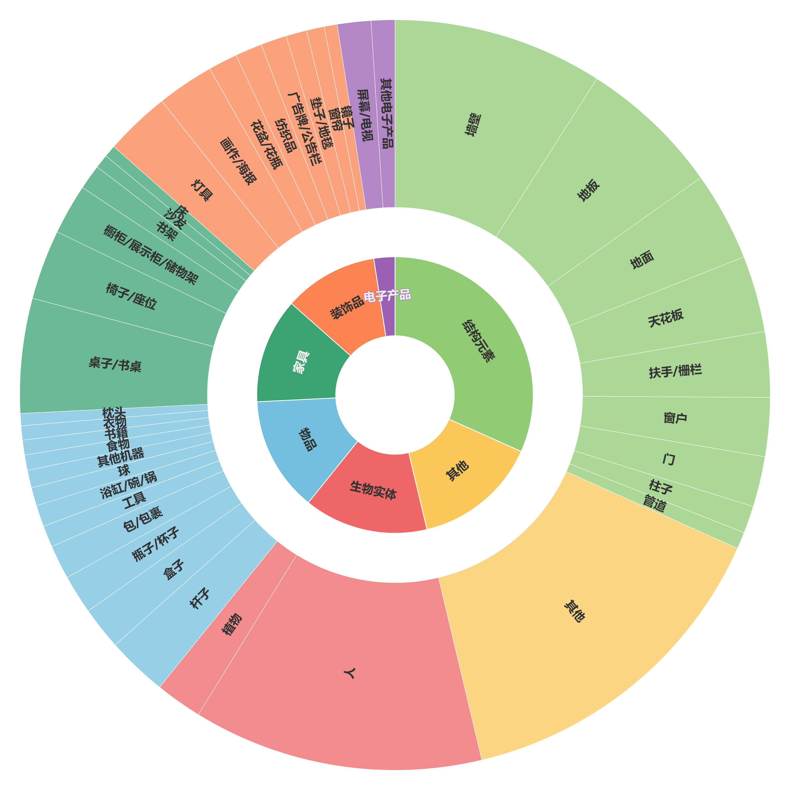
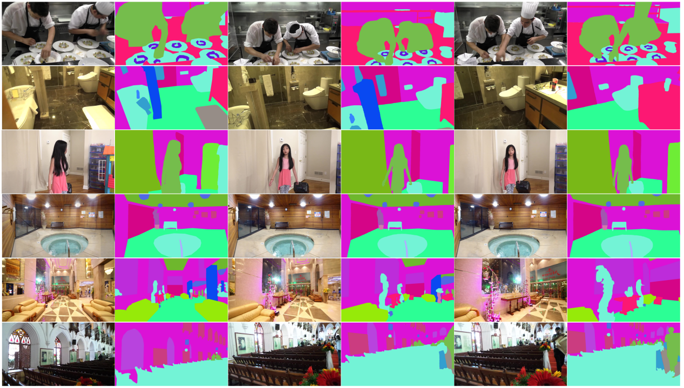

# ISIV (Incremental Segmentation for Indoor Video)
The dataset of ISIV (**I**ncremental **S**egmentation for **I**ndoor **V**ideo).


## 🎨 Introduction

ISIV is an indoor Scene incremental segmentation dataset developed from the video segmentation dataset [VSPW](https://github.com/sssdddwww2/CVPR2021_VSPW_Implement). The ISIV comprises 1,661 video segments (totaling 4,983 frames) of indoor scenes, encompassing 40 categories.


ISIV follows a two-tier structure, including:

* **Structural Elements**: Includes essential structural components of indoor scenes, such as walls, floors, and ceilings.
* **Furnishings**: Primarily consists of various functional furniture items, including tables, chairs, and sofas.
* **Decorations**: Comprises highly decorative items, such as lighting fixtures, paintings, and mirrors.
* **Electronics**: Specifically categorizes indoor electronic devices, including televisions and screens.
* **Objects**: Covers a range of small or everyday items used indoors, such as bottles, books, and food.
* **Living Entities**: Includes humans and plants, reflecting the biological elements within indoor environments.

<p align="center"></p>

A sample of the ISIV dataset is displayed below. There are three sets of data collected from a single video. Columns 1, 3, and 5 display the original images, while columns 2, 4, and 6 present the corresponding annotation information.

<p align="center"></p>

## :open_file_folder: Download Dataset

The download links of Google Driver and Baidu Netdisk:

|  | Link |
| -------- | -------- |
| Google Driver     | [Download](https://drive.google.com/file/d/1qd63d-BiFh-Q-vfsz4O6YSAFpkBpDNiL/view?usp=drive_link)     |
| Baidu Netdisk | [Download](https://pan.baidu.com/s/1w9O6EVbplgt2gSVZXuMPSw?pwd=9xd7) |

## :pushpin: Structure
Below is an overview of the directory and file structure:
```
indoor_dataset
├── img
│   ├── 1001_3iEIq5HBY1s_0.jpg
│   ├── 1001_3iEIq5HBY1s_1.jpg
│   ├── ...
├── mask
│   ├── 1001_3iEIq5HBY1s_0.jpg
│   ├── 1001_3iEIq5HBY1s_1.jpg
│   ├── ...
├── proposal
│   ├── 1001_3iEIq5HBY1s_0.jpg
│   ├── 1001_3iEIq5HBY1s_1.jpg
│   ├── ...
```


## :pencil: Citation
If this codebase is useful to you, please cite our work:
```
@misc{ISIV2025,
  title        = {Incremental Segmentation for Indoor Video (ISIV) Dataset},
  author       = {Zekang Zhang and Xiao Yu and Hongguang Zhu and Yan Fang and Yunchao Wei and Yao Zhao},
  institution  = {The Institute of Information Science, Beijing Jiaotong University},
  howpublished = {\url{https://github.com/hhhhh12131/ISIV}},
  year         = {2024}
}
```
